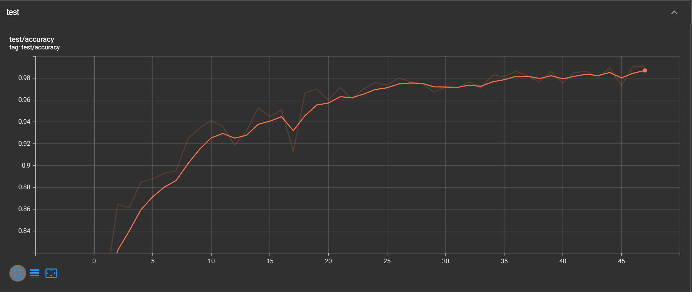

# Tomato Leaf Disease Detection
deep CNN for image classification

## Introduction
This project aims to detect diseases on tomato leaves and recommend appropriate solutions.

## Dataset
The dataset is available at [Kaggle](https://www.kaggle.com/datasets/emmarex/plantdisease) and contains 10 classes of tomato leaf diseases.

| Class | Train Samples | Test Samples |
|-------|---------------|--------------|
| Tomato___Bacterial_spot | 2127          | 532          |
| Tomato___Early_blight | 2008          | 502          |
| Tomato___Late_blight | 1908          | 381          |
| Tomato___Leaf_Mold | 958           | 191          |
| Tomato___Septoria_leaf_spot | 2127          | 425          |
| Tomato___Spider_mites Two-spotted_spider_mite | 1676          | 335          |
| Tomato___Target_Spot | 1404          | 280          |
| Tomato___Tomato_Yellow_Leaf_Curl_Virus | 3280          | 656          |
| Tomato___Tomato_mosaic_virus | 373           | 77           |
| Tomato___healthy | 1591          | 318          |

## Technologies
- pytorch
- sklearn
- python

## training
If you want to train a model with a specific dataset, you could run:

- **python train_model.py --root your_dataset_root**

If you want to train a model with common dataset and your preference parameters, like optimizer and learning rate, you could run:

- **python train_model.py -e your_epoch -b batch_size**

If want to run my model, you could run:

- **python View.py**

## Experiment
My model is quite lightweight so I run directly on a local machine with an NVIDIA GeForce RTX 3060 GPU.

The training/testing accuracy/loss curve for each experiment of the dataset with more than 50 epochs is shown below:

- train

- test

- Confusion Matrix

- result

